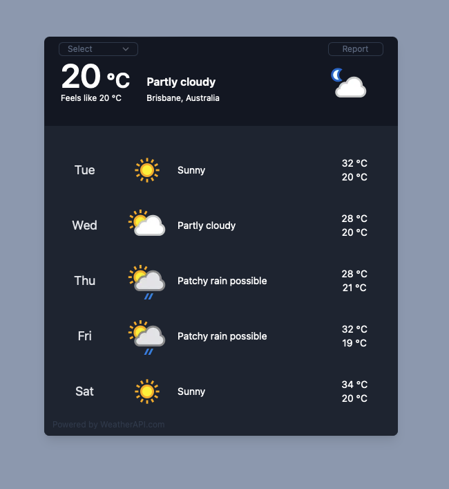

# **Cloudyy**
## **Weather APP powered by WeatherAPI.com**
----------------------------------------------------------------

### coded on **Reac.js Laravel, Tailwind CSS**

### Before start please make sure you do the below

```bash
composer install

npm install --force
```


### Please add API key in  .ENV 
```
WEATHER_API_KEY= your_key
```





